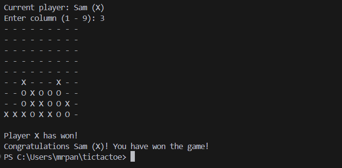
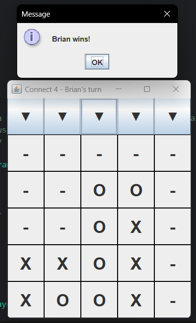

# Connect Foe

A classic Connect Four game implementation written in Java. There are two ways to play the game, either the GUI or the CLI. This project was created as a personal challenge to build a fully functional game in a single day. Currently featuring a complete two-player mode where players can compete against each other in the terminal. The game includes proper move validation, win detection, and draw handling.

## Features

- Two-player gameplay

## Future Changes

- CPU/computer mode

## Run the game

1. Clone the repo 
2. To run the CLI, run main in:

```src\GameRunner.java```

3. To run the GUI, run main in:

```src\gui\Connect4GUI.java```


## Example CLI game



## Example GUI game

